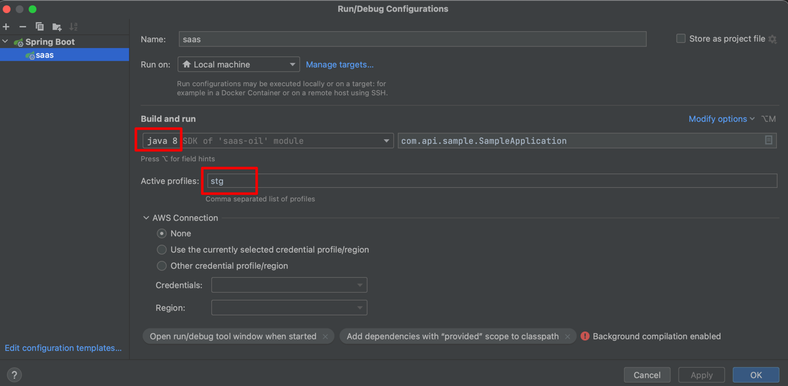

1. 오른쪽 상단 [Edit Configuration...]

2. java version 8 설정
3. Active profiles: stg

# API Sample
spring boot api sample [yml(yaml), feign, mybatis, log4jdbc, lucy-filter]

# Swagger http://localhost:8080/swagger-ui.html

※ 현재 버전상 DB 연결은 다시 제거해두었습니다.
- API 테스트만 가능
- 추후 암호화 DB 정보 설정 예정